# TÀI LIỆU ĐẶC TẢ YÊU CẦU PHẦN MỀM (SRS) - DỰ ÁN RELOOP
**Mã đề tài**: HUSC-33  
**Tên hệ thống**: ReLoop - Nền tảng kết nối trao đổi và mua bán đồ đã qua sử dụng  
**Chuẩn tài liệu**: Dựa trên cấu trúc chuẩn [SRS_Template.docx](file:///d:/Doc/DOAN/SRS_Template.docx)

---

# MỤC LỤC
- [1. Giới thiệu (Introduction)](#1-giới-thiệu-introduction)
  - [1.1 Mục đích tài liệu (Purpose)](#11-mục-đích-tài-liệu-purpose)
  - [1.2 Tổng quan hệ thống (Overview)](#12-tổng-quan-hệ-thống-overview)
  - [1.3 Đối tượng đọc tài liệu (Intended Audience)](#13-đối-tượng-đọc-tài-liệu-intended-audience)
  - [1.4 Thuật ngữ và từ viết tắt (Abbreviations)](#14-thuật-ngữ-và-từ-viết-tắt-abbreviations)
  - [1.5 Tài liệu tham khảo (References)](#15-tài-liệu-tham-khảo-references)
- [2. Yêu cầu cấp cao (High-Level Requirements)](#2-yêu-cầu-cấp-cao-high-level-requirements)
  - [2.1 Sơ đồ thực thể liên kết (Entity Relationship Diagram - ERD)](#21-sơ-đồ-thực-thể-liên-kết-entity-relationship-diagram---erd)
  - [2.2 Sơ đồ luồng công việc (Workflows / Activity Diagrams)](#22-sơ-đồ-luồng-công-việc-workflows--activity-diagrams)
  - [2.3 Sơ đồ chuyển trạng thái (State Transition Diagrams)](#23-sơ-đồ-chuyển-trạng-thái-state-transition-diagrams)
  - [2.4 Sơ đồ Use Case tổng quan & phân hệ (Use Case Diagrams)](#24-sơ-đồ-use-case-tổng-quan--phân-hệ-use-case-diagrams)
  - [2.5 Ma trận phân quyền (Permission Matrix)](#25-ma-trận-phân-quyền-permission-matrix)
- [3. Đặc tả chi tiết 28 Use Cases (Use Case Specifications)](#3-đặc-tả-chi-tiết-28-use-cases-use-case-specifications)
- [4. Thiết kế giao diện mẫu (Screen Mockups & Wireframes)](#4-thiết-kế-giao-diện-mẫu-screen-mockups--wireframes)
- [5. Yêu cầu phi chức năng (Non-Functional Requirements)](#5-yêu-cầu-phi-chức-năng-non-functional-requirements)

---

# 1. Giới thiệu (Introduction)

## 1.1 Mục đích tài liệu (Purpose)
Tài liệu này đặc tả chi tiết toàn bộ các yêu cầu chức năng, yêu cầu phi chức năng, mô hình dữ liệu, luồng nghiệp vụ và giao diện cho hệ thống **ReLoop - Nền tảng kết nối trao đổi và mua bán đồ đã qua sử dụng**.  
Tài liệu đóng vai trò là kim chỉ nam chính thức phục vụ các mục tiêu:
* Làm căn cứ nghiệm thu và đánh giá đồ án môn học.
* Cung cấp thông số chuẩn xác cho quá trình thiết kế cơ sở dữ liệu và kịch bản kiểm thử (Testcase).
* Cung cấp kiến thức nghiệp vụ nền tảng phục vụ kỳ thi Final cuối môn (trên máy tính ngắt mạng).

## 1.2 Tổng quan hệ thống (Overview)
**ReLoop** là nền tảng thương mại C2C (Customer to Customer) kết nối những người dùng có nhu cầu thanh lý, mua bán hoặc trao đổi các món đồ cũ/đã qua sử dụng tại địa phương.
* **Mô hình trọng tâm**: **Gặp mặt trực tiếp (In-person Meetup)**. Khác với các sàn thương mại điện tử giao hàng qua bên thứ 3 và thanh toán trung gian phức tạp, ReLoop hỗ trợ người dùng tìm kiếm sản phẩm gần mình nhất theo khu vực địa phương (Tỉnh/Thành phố, Quận/Huyện), kết nối trực tiếp qua số điện thoại/Zalo, thỏa thuận gặp mặt ngoài đời thực để kiểm tra đồ và giao dịch, sau đó hoàn tất tiến trình trên hệ thống để tích lũy điểm uy tín cộng đồng.
* **Hai hình thức giao dịch chính**:
  1. *Mua bán*: Đăng sản phẩm kèm mức giá bán cố định.
  2. *Trao đổi (Barter)*: Người mua đề xuất một món đồ từ kho đồ cá nhân của mình để đổi lấy sản phẩm của người bán (có thể kèm ghi chú bù trừ tiền mặt).

## 1.3 Đối tượng đọc tài liệu (Intended Audience)
* **Thành viên nhóm dự án**: Nắm vững luồng nghiệp vụ và ranh giới hệ thống để thiết kế Testcase và trả lời vấn đáp/thi Final.
* **Nhóm sinh viên review chéo**: Dùng để đối chiếu, kiểm tra tính đúng đắn, nhất quán và độ bao phủ của yêu cầu.
* **Giảng viên hướng dẫn & chấm thi**: Đánh giá mức độ hoàn thiện về mặt phân tích và thiết kế phần mềm.

## 1.4 Thuật ngữ và từ viết tắt (Abbreviations)
| Viết tắt | Thuật ngữ đầy đủ | Ý nghĩa tiếng Việt |
| :--- | :--- | :--- |
| **SRS** | Software Requirements Specification | Tài liệu đặc tả yêu cầu phần mềm |
| **UC** | Use Case | Ca sử dụng |
| **ERD** | Entity Relationship Diagram | Sơ đồ thực thể liên kết |
| **BR** | Business Rule | Quy tắc nghiệp vụ |
| **C2C** | Customer to Customer | Khách hàng giao dịch với khách hàng |
| **Barter** | Barter / Item Exchange | Hình thức trao đổi vật phẩm lấy vật phẩm |
| **Meetup** | In-person Meetup | Cuộc gặp mặt trực tiếp để giao dịch |
| **JWT** | JSON Web Token | Chuỗi mã hóa dùng để xác thực người dùng |
| **BVA** | Boundary Value Analysis | Kỹ thuật phân tích giá trị biên (Kiểm thử) |
| **EP** | Equivalence Partitioning | Kỹ thuật phân vùng tương đương (Kiểm thử) |

## 1.5 Tài liệu tham khảo (References)
1. *HUSC-33_Requirement Outline.xlsx* - Đề cương yêu cầu dự án ReLoop.
2. *SRS_Template.docx* - Mẫu tài liệu đặc tả yêu cầu chuẩn.
3. *UseCase-SRS.docx* - Danh mục 28 Use Cases và Ma trận phân quyền.

---

# 2. Yêu cầu cấp cao (High-Level Requirements)

## 2.1 Sơ đồ thực thể liên kết (Entity Relationship Diagram - ERD)

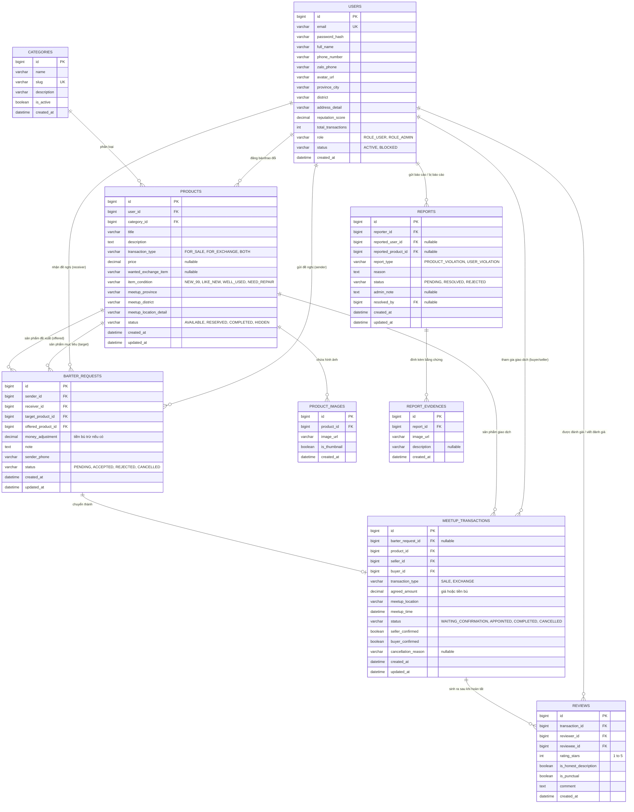

---

## 2.2 Sơ đồ luồng công việc (Workflows / Activity Diagrams)

### 2.2.1 Luồng Đăng tin & Quản lý sản phẩm cá nhân
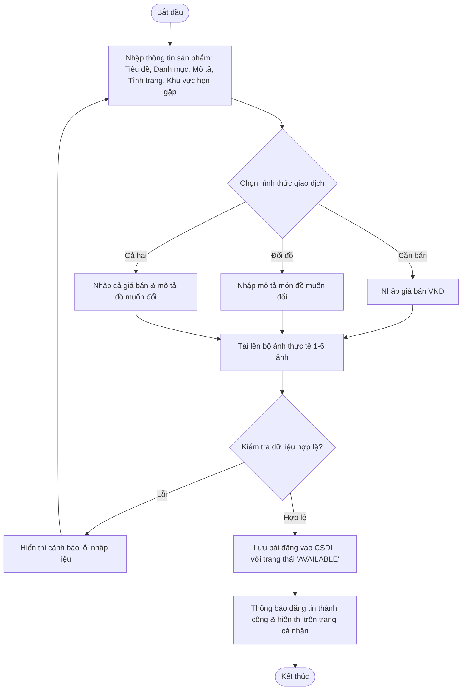

### 2.2.2 Luồng Đề nghị trao đổi sản phẩm (Barter Flow)
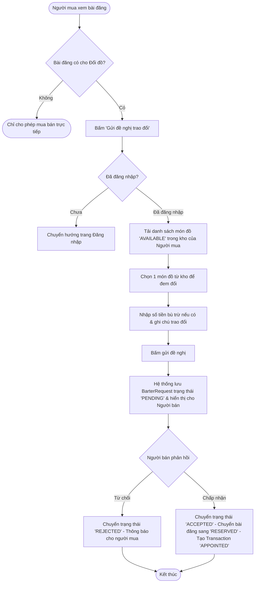

### 2.2.3 Luồng Vòng đời Giao dịch gặp mặt trực tiếp (Meetup Transaction Lifecycle)
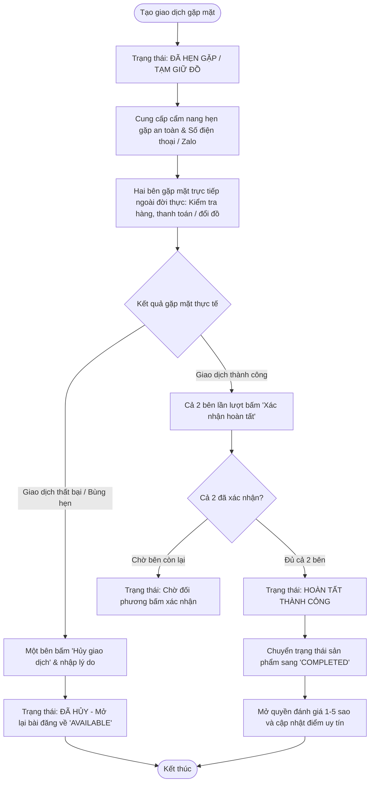

---

## 2.3 Sơ đồ chuyển trạng thái (State Transition Diagrams)

### 2.3.1 Sơ đồ chuyển trạng thái Sản phẩm (Product Status)
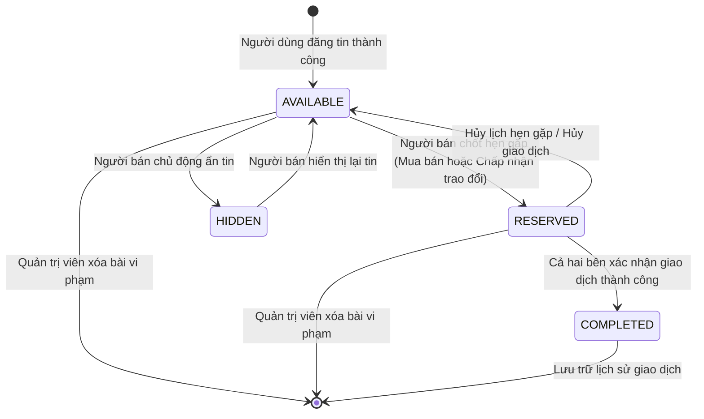

### 2.3.2 Sơ đồ chuyển trạng thái Giao dịch gặp mặt (Meetup Transaction Status)
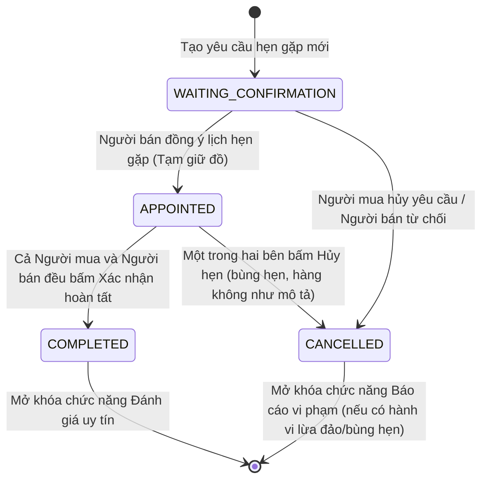

---

## 2.4 Sơ đồ Use Case tổng quan & phân hệ (Use Case Diagrams)

### 2.4.1 Nhóm 1: Quản lý tài khoản & hồ sơ cá nhân
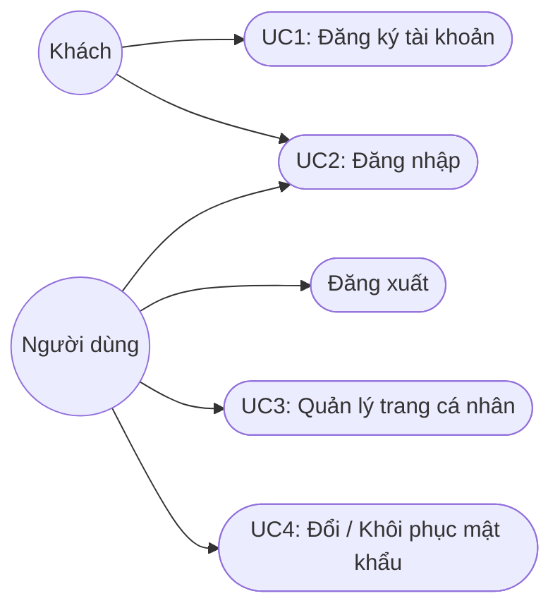

### 2.4.2 Nhóm 2: Quản lý bài đăng & sản phẩm
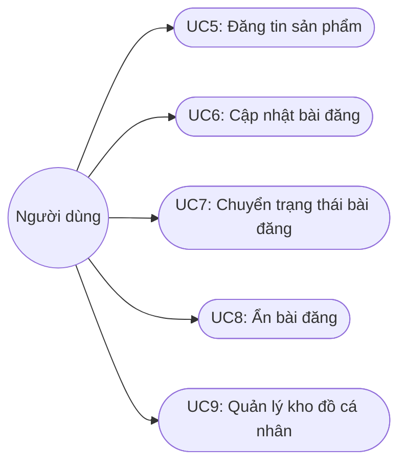

### 2.4.3 Nhóm 3: Tìm kiếm và khám phá
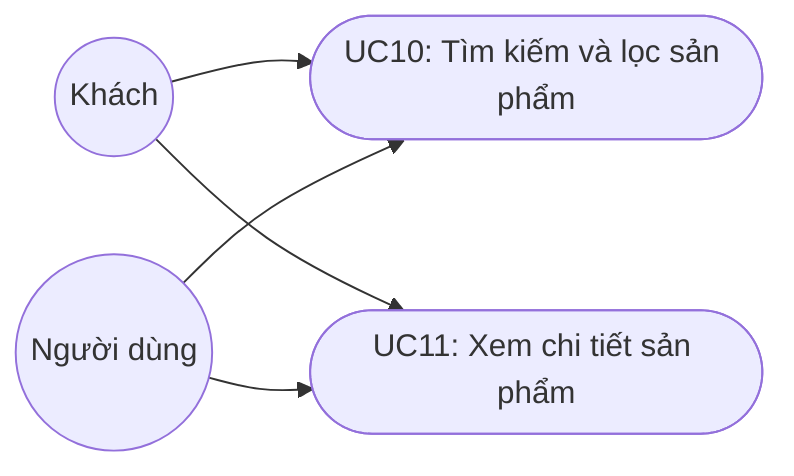

### 2.4.4 Nhóm 4: Trao đổi và giao dịch gặp mặt trực tiếp
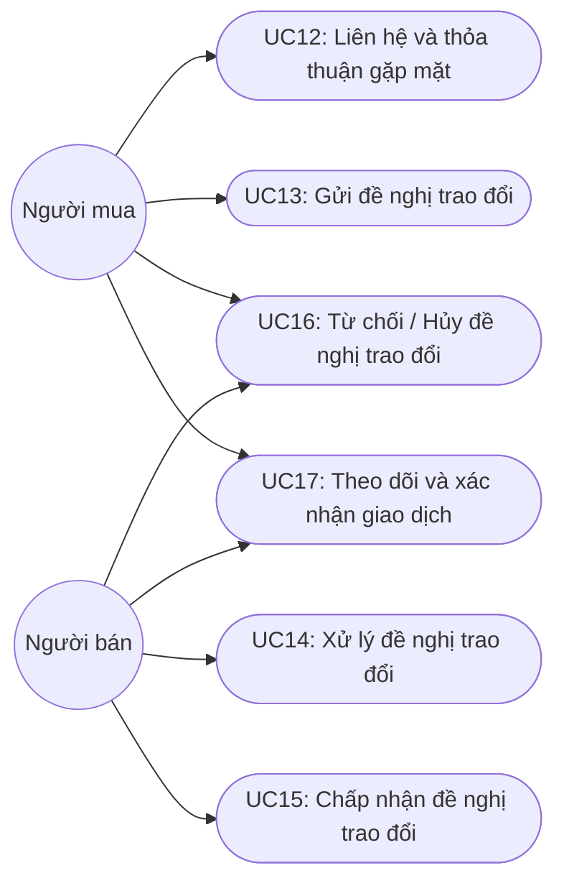

### 2.4.5 Nhóm 5: Đánh giá và báo cáo vi phạm
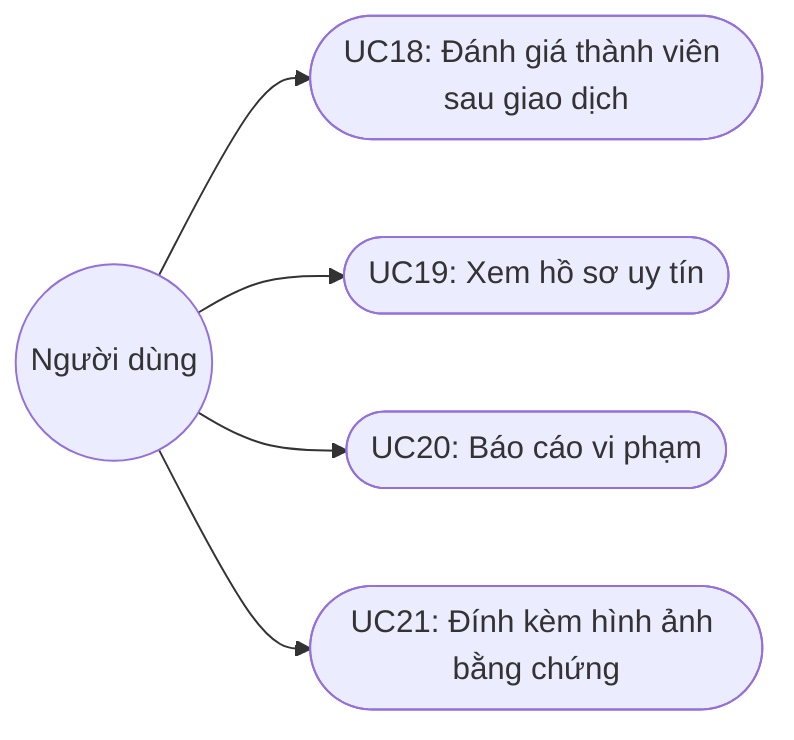

### 2.4.6 Nhóm 6: Phân hệ Quản trị viên (Admin)
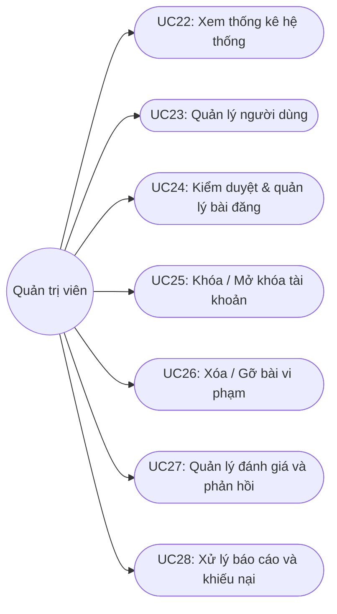

---

## 2.5 Ma trận phân quyền (Permission Matrix)

**Ký hiệu quy ước**:
* **X**: Toàn quyền thực hiện chức năng.
* **X\***: Chỉ có quyền thao tác trên dữ liệu/bản ghi do chính mình tạo ra hoặc liên quan trực tiếp đến mình.
* *(Trống)*: Không có quyền truy cập/thực hiện.

| Phân hệ / Ca sử dụng (Use Case) | Khách (Guest) | Người dùng (User) | Quản trị viên (Admin) |
| :--- | :---: | :---: | :---: |
| **Nhóm 1: Quản lý tài khoản & hồ sơ** | | | |
| UC 01: Đăng ký tài khoản | X | | |
| UC 02: Đăng nhập / Đăng xuất | X | X | X |
| UC 03: Quản lý trang cá nhân | | X\* | X |
| UC 04: Đổi / Khôi phục mật khẩu | X | X\* | X\* |
| **Nhóm 2: Quản lý bài đăng & sản phẩm** | | | |
| UC 05: Đăng tin sản phẩm mới | | X | |
| UC 06: Cập nhật thông tin bài đăng | | X\* | X |
| UC 07: Chuyển trạng thái bài đăng | | X\* | X |
| UC 08: Ẩn / Hiện bài đăng | | X\* | |
| UC 09: Quản lý kho đồ cá nhân | | X\* | |
| **Nhóm 3: Tìm kiếm & khám phá** | | | |
| UC 10: Tìm kiếm và lọc sản phẩm | X | X | X |
| UC 11: Xem chi tiết sản phẩm | X | X | X |
| **Nhóm 4: Trao đổi & giao dịch** | | | |
| UC 12: Liên hệ & thỏa thuận gặp mặt | | X | |
| UC 13: Gửi đề nghị trao đổi | | X | |
| UC 14: Xử lý đề nghị trao đổi | | X\* | |
| UC 15: Chấp nhận đề nghị trao đổi | | X\* | |
| UC 16: Từ chối / Hủy đề nghị trao đổi | | X\* | |
| UC 17: Theo dõi & xác nhận hoàn tất giao dịch | | X\* | X |
| **Nhóm 5: Đánh giá & báo cáo** | | | |
| UC 18: Đánh giá thành viên | | X\* | |
| UC 19: Xem hồ sơ uy tín công khai | X | X | X |
| UC 20: Báo cáo vi phạm (bài đăng / người dùng) | | X | |
| UC 21: Đính kèm bằng chứng báo cáo | | X | |
| **Nhóm 6: Quản trị viên (Admin)** | | | |
| UC 22: Xem thống kê & báo cáo hệ thống | | | X |
| UC 23: Quản lý danh sách người dùng | | | X |
| UC 24: Kiểm duyệt bài đăng & danh mục | | | X |
| UC 25: Khóa / Mở khóa tài khoản | | | X |
| UC 26: Xóa / Gỡ bài viết vi phạm | | | X |
| UC 27: Quản lý đánh giá & phản hồi | | | X |
| UC 28: Tiếp nhận & xử lý báo cáo, khiếu nại | | | X |

---

*(Nội dung phần 3: Đặc tả chi tiết 28 Use Cases và phần 4: Mockup Layouts tiếp tục được triển khai chi tiết ở tài liệu này)*
